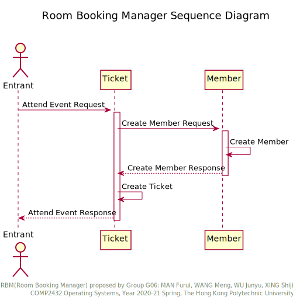

# COMP2432_RBM

Room Booking Manager System as the Group Project of COMP2432 in year 2020-21 spring.

## Deployment

To deploy the program, `cd` to the project's root directory and execute `build.sh` script. The program have dependency upon `gcc` 4.0+ and Linux 3.0+.

```sh
git clone https://github.com/toolsmax0/COMP2432_RBM.git
cd COMP2432_RBM
sh build.sh
```

To execute the program, run the following command.

```sh
./out/RBM
```

To modify the component settings (i.e. tenants, rooms, devices), modify `RBM.ini` file according to its syntax. 

For further information, observe the following [directory structure](#directory-structure).

## Program Structure

### Activity Diagram

The activity diagram of the program is demonstrated by the following picture.




### Directory Structure

```
../COMP2432_RBM
.
├── doc                     # documentation
│   └── ...
├── out                     # out files
│   └── ...
├── res                     # resources
│   └── ...
├── test                    # test batch files
│   ├── *_invalid.dat       # invalid tests
│   ├── *.dat               # valid tests
│   └── ...
├── src                     # C source code
│   ├── lib                 # submodules and libraries
│   │   └── ...
│   ├── main.c              # main source code file
│   └── master.h            # master header file
├── build.sh                # script for compiling
├── RBM.ini                 # component settings
├── README.md               # guide
└── LICENSE
```

## License

This project is under [GPL-3.0 License](./LICENSE).

## Open Source Libraries

- [iniparser](https://github.com/ndevilla/iniparser)

---

### iniparser

Copyright (c) 2000-2011 by Nicolas Devillard.
MIT License

Permission is hereby granted, free of charge, to any person obtaining a
copy of this software and associated documentation files (the "Software"),
to deal in the Software without restriction, including without limitation
the rights to use, copy, modify, merge, publish, distribute, sublicense,
and/or sell copies of the Software, and to permit persons to whom the
Software is furnished to do so, subject to the following conditions:

The above copyright notice and this permission notice shall be included in
all copies or substantial portions of the Software.

THE SOFTWARE IS PROVIDED "AS IS", WITHOUT WARRANTY OF ANY KIND, EXPRESS OR
IMPLIED, INCLUDING BUT NOT LIMITED TO THE WARRANTIES OF MERCHANTABILITY,
FITNESS FOR A PARTICULAR PURPOSE AND NONINFRINGEMENT. IN NO EVENT SHALL THE
AUTHORS OR COPYRIGHT HOLDERS BE LIABLE FOR ANY CLAIM, DAMAGES OR OTHER
LIABILITY, WHETHER IN AN ACTION OF CONTRACT, TORT OR OTHERWISE, ARISING
FROM, OUT OF OR IN CONNECTION WITH THE SOFTWARE OR THE USE OR OTHER
DEALINGS IN THE SOFTWARE.